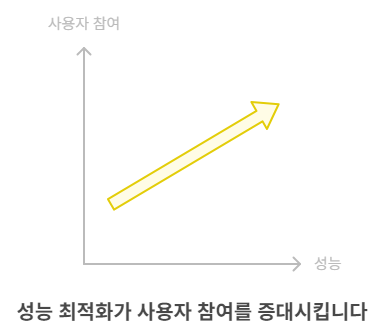
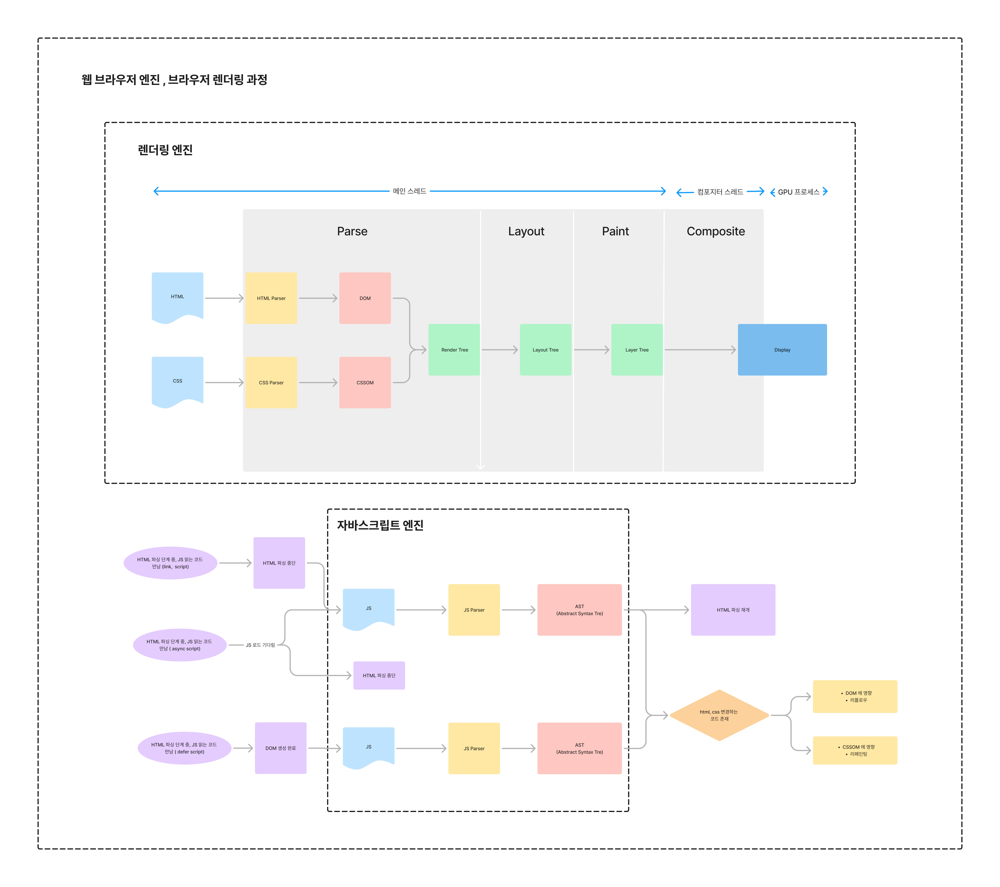

# 성능 최적화

## 1. 성능 최적화 필요성

### UX와 고객 유치

성능을 개선하는 것은 고객 유치와 유지에 밀접한 관계가 있다. 사이트 속도가 빨라지면 운영 비용이 감소하고, 사용자 경험(UX)이 개선된다. 성능 개선 사례로 Tokopedia와 Pinterest의 성공적인 최적화 결과를 들 수 있다.

- **[Tokopedia](https://wpostats.com/2018/05/30/tokopedia-new-users.html)**: 3G 연결에서 렌더링 시간을 14초에서 2초로 줄여 방문자 19% 증가
- **[Pinterest](https://wpostats.com/2017/03/10/pinterest-seo.html)**: 페이지 성능을 개선해 대기 시간을 40% 줄이고 SEO 트래픽과 전환율이 각각 15% 증가

[구글의 연구](https://www.ascentkorea.com/core-web-vitals/)에서도 성능이 고객 유치에 얼마가 영향을 주는 지 알 수 있다. **코어 웹 바이탈**(Core Web Vitals)을 충족한 페이지는 방문자가 사이트를 떠날 확률이 24% 낮다. 모바일 기기의 경우 모바일 사이트의 53%가 로드하는데 3초 이상 걸리면 사용자는 해당 사이트를 떠났다.

- 코어 웹 바이탈(Core Web Vitals)?
  구글이 웹 콘텐츠 이용자의 사용자 경험에 영향르 미치는 다양한 값 중 중요시 여기는 3가지로,
  LCP(Largest Contentful Pain), FID(First Input Delay), CLS(Cumulative Layout Shift)가 있습니다.

### SEO (검색 최적화)

성능은 UX뿐만아니라 검색 엔진의 순위에도 영향을 준다.
2010년 구글은 사이트 속도가 검색 순위에 반영된다고 [발표](https://developers.google.com/search/blog/2010/04/using-site-speed-in-web-search-ranking)했습니다. 발표 이후 색 순위에서의 사이트 속도의 중요도는 점점 커졌다.

결국 성능 최적화를 진행하는 이유는 **'사용자에게 불편함 없는 서비스 제공해 비즈니스적 이점을 취하는 것'**에 있다.



## 2. 성능 측정

### 측정 항목

성능 최적화의 목표가 UX 증대이듯, 성능 측정 항목도 사용자가 실직적으로 서비스를 사용하는 방식과 밀접한 관련이 있다.

- **인식된 로드 속도:** 페이지가 로드되고 모든 시각적 요소를 화면에 렌더링할 수 있는 속도
- **로드 응답성:** 구성요소가 사용자 상호작용에 빠르게 응답하기 위해 페이지가 필요한 자바스크립트 코드를 로드하고 실행할 수 있는 속도
- **런타임 응답성:** 페이지 로드 후 페이지가 사용자 상호작용에 얼마나 빠르게 반응할 수 있는가
- **시각적 안정성:** 페이지 요소가 사용자가 예상하지 못한 방식으로 전환되어 상호작용을 방해하는가
- **부드러움:** 전환 및 애니메이션이 일관된 프레임 속도로 렌더링되고 한 상태에서 다음 상태로 부드럽게 흐르는가?

### 측정 지표

웹 성능을 측정하는 중요한 지표에는 **LCP**, **FCP**, **CLS** 등이 있다. 이러한 지표를 사용하여 웹 페이지의 성능을 평가하고 개선할 수 있다.

|지표|설명|
|LCP(Largest Contentful Paint)|페이지 로드 중 가장 큰 이미지나 텍스트 블록이 화면에 표시되는 시간|
|FCP(First Contentful Paint)|페이지 로드 중 처음으로 화면에 텍스트나 이미지가 나타나는 시간|
|CLS(Cumulative Layout Shift)|예기치 않은 레이아수 변화가 발생하는 빈도|
|TTFB(Time to First Byte)|사용자가 요청 보낸 후 서버가 첫 번째 바이트를 응답하는 데 걸리는 시간|
|INP(Interaction to Next Paint)|사용자가 상호작용(클릭,탭등)을 하고 그에 따른 화면 갱신이 일어나는 지연 시간|

#### PageSpeedTools의 품질 평가 기준

| 지표 | 좋음        | 개선 필요        | 나쁨        |
| ---- | ----------- | ---------------- | ----------- |
| FCP  | [0, 1800ms] | (1800ms, 3000ms] | 3000ms 초과 |
| LCP  | [0, 2500ms] | (2500ms, 4000ms] | 4000ms 초과 |
| CLS  | [0, 0.1]    | (0.1, 0.25]      | 0.25 초과   |

### 측정 도구

#### [Goggle Lighthouse](https://pagespeed.web.dev/)

웹 페이지의 종합적인 성능을 평가하고, 접근성, SEO, PWA 성능까지 측정 가능. 성능 최적화 방법도 제시한다. 모바일과 테스트톱 성능을 평가할 수있다.

#### [Page Speed Insights](https://pagespeed.web.dev/)

실사용자 데이터를 바탕으로 웹 페이지의 속도와 성능을 분석한다. 모바일과 테스트톱 성능을 평가할 수있다.

### [WebPageTest](https://stratoflow.com/website-performance-metrics/)

다양한 국가, 브라우저, 기기에서 테스트 가능해 다양한 환경에서 성능을 테스트할 수 있다. 또한 세부적인 성능 병목을 분석하는 데 유용하다.

### Chrome DevTools

크롬의 개발자 도구로, 개발자 도구를 통해 페이지 로딩 중 발생하는 다양한 작업의 타이밍,리소스 크기, 캐시 여부등을 분석할 수 있다. network, performance에서 네트워크나 cpu 감속에 따른 테스트도 진행할 수 있다. 크롬에서 제공하는 다양한 성능 측정 플러그인(ex [React Developer Tools](https://chromewebstore.google.com/detail/React%20Developer%20Tools/fmkadmapgofadopljbjfkapdkoienihi), [LCP&CLS Monitor](https://chromewebstore.google.com/detail/lcp-cls-monitor/lcifpchofigigpgmhpghagcifokadjaa))을 통해 확장된 여러 성능 측정이 가능하다.

#### [GTmetrix](https://gtmetrix.com/)

웹 페이지의 로딩 성능을 분석하고, 최적화 방안을 제시한다. 성능 이력 추적 및 세부적인 성능 분석 가능하다.

- 측정 도구별 주요 성능 측정 지표
  |도구|주요 성능 측정 지표|
  |----|------------------|
  |Google Lighthouse| LCP, FCP, CLS, TBT, INP, PWA 성능|
  |PageSpeed Insights| LCP, FCP, CLS, TBT, TTI|
  |WebPageTest| LCP, TTFB, CLS, Speed Index, First Byte, Time to Interactive|
  |Chrome DevTools Performance Panel| JavaScript 실행 시간, 리플로우, 리페인트, 네트워크 요청 시간|
  |GTmetrix| LCP, FCP, CLS, Page Load Time, Total Page Size, HTTP Requests|

## 3. 브라우저 렌더링 과정

성능 저하의 원인과 개선 방법을 이야기에 앞서, 브라우저 렌더링 과정에 대한 이해가 필요하다.



브라우저에는 여러 엔진이 있다. 그 중 브라우저 렌더링 과정과 직간접으로 영향이 있는 엔진은 렌더링 엔지과 자바스크립트 엔진이다. 렌더링 엔진은 리소스(html, css, 이미지등)를 파싱하여 웹 페이지에 그린다. 자바스크립트 엔진은 자바스크립트 코드를 파싱하여 페이지 상호작용 및 동적 변화를 처리한다.

렌더링 엔진에서 일어나는 브라우저 렌더링 과정은 다음과 같다.

### 렌더링 엔진의 브라우저 렌더링 과정

**1. 파싱 단계**
HTML 파일을 파싱해 DOM을 생성하고, CSS 파일을 파싱해 CSSOM을 생성한다.
**2. 레이아웃**
DOM과 CSSOM을 결합하여 렌더 트리를 구성하고, 각 요소의 위치와 크기를 계산한다.
**3. 페인팅**
요소들의 스타일을 적용하여 화면에 출력할 내용을 결정한다.
**4. 컴포지팅**
이전 단계에서 만든 여러 레이어를 결합나다.
**5. 화면에 표시**
컴포지팅 단계에서 끝낸 결과물은 GPU 프로세스가 화면에 그린다.

#### 리플로우,리페인팅,리컴포지팅

- 리플로우 : DOM 구조나 레이아웃이 변경될대 브라우저가 레이아웃을 다시 계산하는 과정
- 리페인팅: 레이아웃 변화 없이 시각적 스타일이 변경될 때 화면을 다시 그리는 과정
- 리컴포지팅 : 레이어가 변경되거나 애니메이션을 처리할 때 레이어를 GPU가 결합하는 과정

#### 자바스크립트에 의한 DOM,CSSOM 변경

자바스크립트의 파싱 작업이 실행되는 때는 자바스크립트를 실행하는 코드에 따라 다르다.
`head`태그나 `body`태그 시작점에 script 태그가 있다면, HTML 파싱 시 해당 코드를 만다면 HTML 파싱을 중단하고 자바스크립트 엔진이 자바스크립트 파일을 파싱힌다. 자바스크립트 파싱 작업이 끝난 후에 중단된 HTML 파싱을 재개한다.
`body`태그 끝에 있거나 `script`에서 `defer`을 사용했다면 HTML 파싱이 끝나 DOM이 생겨난 후에 자바스크립트 파싱 작업이 이루어진다.
`script`에 `async`를 사용했다면 HTML 파싱 작업에서 해당 태그를 만다면 js파일을 로드하다가 로드가 끝나면 HTML 파싱 작업을 중단하고 자바스크립트 파싱작업을 실행한다.

이렇게 파싱된 자바스크립트 코드에 DOM,CSSOM에 변경을 주는 코드가 있다면, 리플로우와 리페인팅이 발생한다.

## 4. 성능 저하 원인 및 해결 방법

### 로딩 성능

페이지 로딩 성능을 높이기 위해서는 파일 크기를 줄이고, HTTP 요청 수를 최적화하는 것이 중요합니다. Webpack을 이용한 **코드 압축**, **동적 import**, **이미지 최적화**, **캐싱** 등의 방법을 통해 성능을 개선할 수 있습니다.

```js
import React, { lazy, Suspense } from "react";

const LazyComponent = lazy(() => import("./LazyComponent"));

function App() {
  return (
    <Suspense fallback={<div>Loading...</div>}>
      <LazyComponent />
    </Suspense>
  );
}
```

## 렌더링 성능

렌더링 성능을 개선하기 위해서는 CPU 작업을 줄이고, **GPU 가속**을 활용하는 것이 중요합니다. **리컴포지팅**을 일으키는 CSS 속성 (`transform`, `opacity`)을 사용하여 성능을 최적화할 수 있습니다.

```css
/* GPU 가속을 활용한 CSS */
.element {
  transform: translateX(100px);
  opacity: 0.5;
}
```

## 인터랙션 성능

너무 많은 JavaScript가 메인 스레드를 차지하면 사용자 인터랙션이 지연될 수 있습니다. 비동기 처리를 통해 **메인 스레드 블로킹** 문제를 해결하고, `debounce`나 `throttle`을 사용해 이벤트 핸들러를 최적화할 수 있습니다.

```js
// Debounce 예제
function debounce(func, delay) {
  let timeout;
  return function () {
    clearTimeout(timeout);
    timeout = setTimeout(func, delay);
  };
}
```

## 메모리 관리

메모리 누수와 불필요한 객체 생성을 방지하기 위해, 이벤트 리스너나 타이머를 적절히 관리하고, 객체를 재사용하여 메모리를 효율적으로 사용할 수 있습니다.
